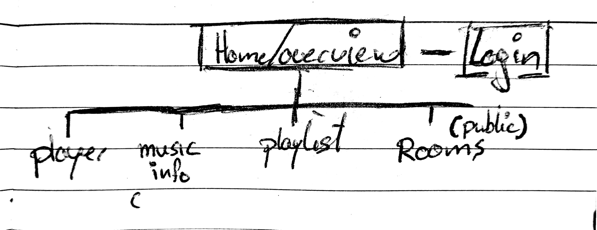

# The process

You can learn a bit about my process here. Some details will be omitted as I will only document the rough lines here.

*This is a Prototypal concept*

# Table of Content
<!-- Add the concept here or in the readme only? -->

<!-- - [Concept](#concept) -->

- [Minimal Features](#minimal-features)
- [Sitemap(draft)](#sitemap-draft)

# Minimal Features
Here the Must, Should and Nice to have features will be listed.

Nothing is definite.

## Must
- Browse
	- Tracks
	- Playslist(s)
	- Rooms (Public)
- Listen to music // Playlist only?
- Join (Public) rooms
- Add tracks to public playlist(s)

## Should
- (up)Vote
	- Tracks (from playlists?)
	- Playlist(s)
- Search function

## Nice
- Create playlists
- Edit playlists
- Create (private) rooms
- Invite people to (private) rooms

*Private rooms should be temporary?*

# Sitemap draft
This is a draft of the current sitemap.

