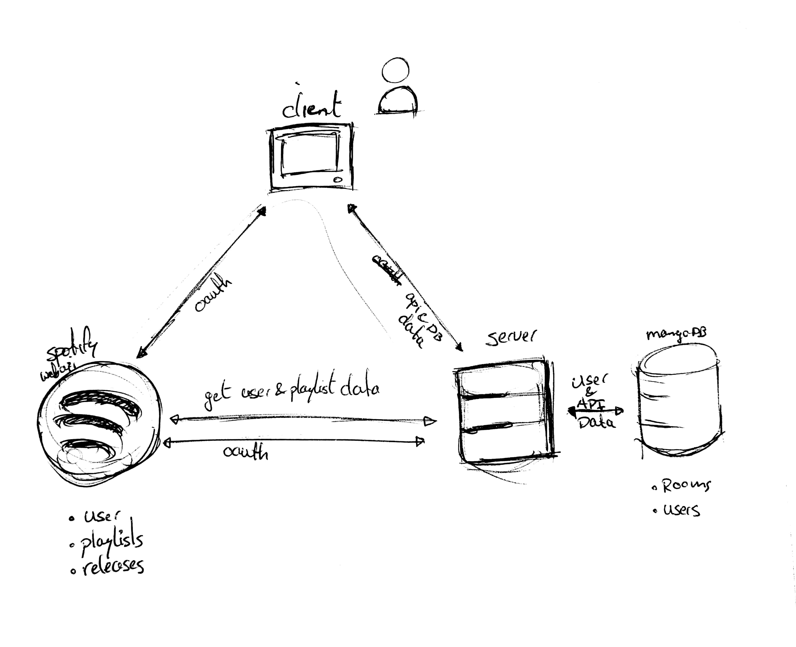

# Playlist collab
This is a Conceptual prototype of a Music player where people can listen to music from the [Spotify API][api]. There is a public playlist where the guests/users can add tracks to.

<!-- The main focus is the public music room which is a room where you can immerse yourself in the music in VR. -->

The process document **[HERE](process.md)**

<!-- This repo will hold the project you're going to build during the last two weeks of RTW. It functions as a way to show you've attained the following learning goals of this course:

- Build a Node Web App which consumes an external data source through an API and serves a frontend using routing and templating techniques.
- Create a "live" web app which reflects changes to the back-end data model in reactive front-end views, using real-time, event-based, messaging technologies like sockets or server-sent-events.
- Describe their work in a professional readme with insightful diagrams showing the life cycle of their data. -->

# Table of Content
- [Getting started](#getting-started)
- [Features](#features)
- [API](#api)
- [Data](#data)
	- [Data retention](#data-retention)
	- [Data life cycle](#data-life-cycle)
- [Tools](#tools)
- [To do](#to-do)

<!-- Add a nice image here at the end of the week, showing off your shiny frontend 📸 -->

# Getting started
If you want to work on this project, follow these steps:
1. First we clone (fork if you want) the repo.
	Run `git clone https://github.com/kyunwang/vr-music.git` in your terminal
2. `cd` to the repo and run `npm install` to install the dependencies
3. Run `npm start` to run the server
4. Go to `http://localhost:4300/`

# Features
The following features are/will be added to application:
<!-- - Listening to music in public rooms. -->
- Add tracks to a public playlist
- See the playlist updating live in public rooms

<!-- What external data source is featured in your project and what are its properties 🌠 -->

# API
This application is using the Web API from Spotify. 

<!-- rate-limit, authorization method, API methods, etc. -->

<!-- Add/note the used package here -->

This app makes use of the [Spotify API][api]

## Limitation
The limitations of the API will be documented here

- The API requires OAUTH 2.0 for every request you make.
- The user requires a spotify account to utilise the application.
- You(Developer) require a Premium account to be able to use the Player endpoints

# Data
The data comes from the *Spotify Web API*. From this API we get will be getting data about playlists, albums, tracks and minimal information about the user.

## Data retention
This application mages use of [MongoDB][mongodb] and uses [mongoose][mongoose] as communication layer. Information about the created rooms and the user will be saved in here.

## Data life cycle
This is overal view of the data cycle in the application.

# Tools

Here are the tools used

The following tools are used:
- Server: Express (Node.js)
- Template engine: Pug
- Bundler: Browserify?
- Code formatter: Prettier
- Socket.io

<!-- Where do the 0️⃣s and 1️⃣s live in your project? What db system are you using?-->

<!-- Maybe a checklist of done stuff and stuff still on your wishlist? ✅ -->
# To do
- [ ] Finish the documentation
- [ ] Update the playlist in the room after adding a track
- [ ] Create private rooms
- [ ] Inviting people to private rooms
- [ ] Have a dropdown(or something similar) for selecting playlists when creating a room
- [ ] Play tracks in a room

<!-- How about a license here? 📜 (or is it a licence?) 🤷 -->

[api]: https://developer.spotify.com/web-api/
[mongodb]: https://www.mongodb.com/
[mongoose]: http://mongoosejs.com/
