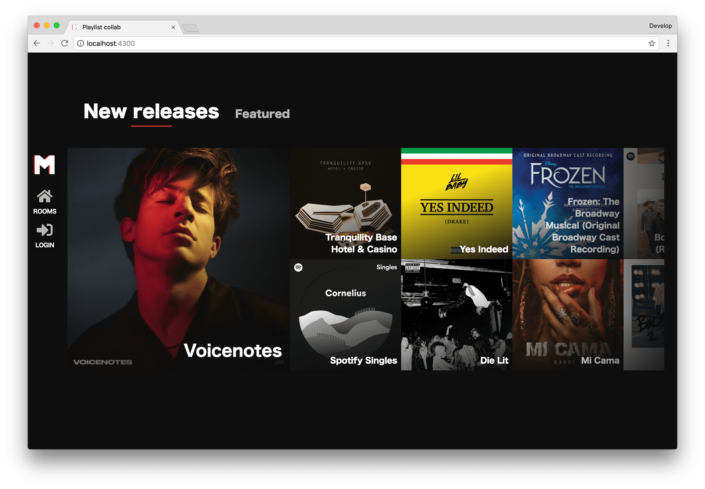
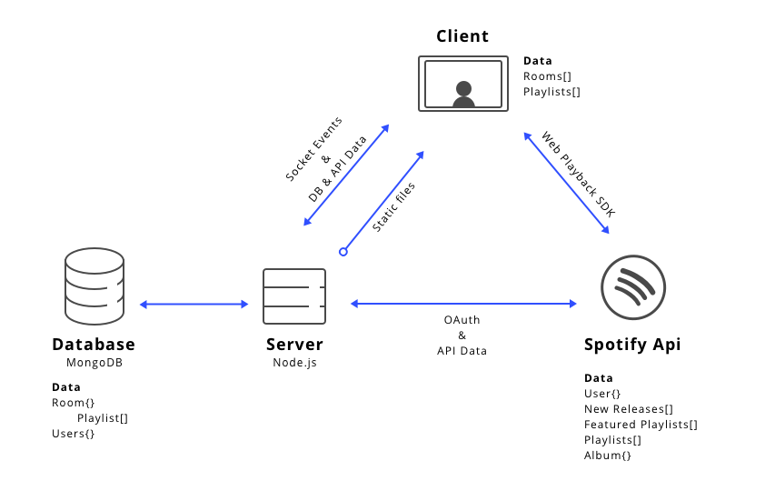

# Playlist collab
This is a Conceptual prototype of a Music player where people can listen to music from the [Spotify API][api]. There is a public playlist where the guests/users can add tracks to.

The process document **[HERE](process.md)**

*This is a prototype with the goal to learn about sockets and spotify api*

# Table of Content
- [Getting started](#getting-started)
- [Features](#features)
- [API](#api)
	- [Limitation](#limitation)
	- [Rate limit](#rate-limit)
- [Data](#data)
	- [Data retention](#data-retention)
	- [Data life cycle](#data-life-cycle)
- [Offline](#offline)
- [Events](#events)
- [Tools](#tools)
- [Wishlist](#wish-list)

# Getting started
If you want to work on this project, follow these steps:
1. First we clone (fork if you want) the repo.
	Run `git clone https://github.com/kyunwang/vr-music.git` in your terminal
2. `cd` to the repo and run `npm install` to install the dependencies
3. Run `npm start` to run the server
4. Go to `http://localhost:4300/`

# Features
The following features are/will be added to application:

**Added**
- Add tracks to a public playlist
- See the playlist updating live in public rooms
- Edit playlists (As the room owner only) e.g. deleting tracks
- Ability to add rooms with your spotify playlist as base (You must be logged in)
- Creating Private rooms
- Listening to music in rooms (Currently only play (not pause ect.))

**To be added**

# API
This application is using the Web API from Spotify. 

This app makes use of the [Spotify API][api]

And a package called [spotify web api node](http://michaelthelin.se/spotify-web-api-node/) which is a node wrapper over the spotify api.

## Limitation
The limitations of the API will be documented here

- The API requires OAUTH 2.0 for every request you make.
- The user requires a spotify account to utilise the application.
- You(Developer) require a Premium account to be able to use the Player endpoints [These endpoints](https://beta.developer.spotify.com/console/player/)

## Rate limit
There is not a strict number mentioned in the docs as for the rate limit issue.

See the docs [here](https://beta.developer.spotify.com/documentation/web-api/) under the header *Rate Limiting*

# Data
The data comes from the *Spotify Web API*. From this API we get will be getting data about playlists, albums, tracks and minimal information about the user.

## Data retention
This application mages use of [MongoDB][mongodb] and uses [mongoose][mongoose] as communication layer. Information about the created rooms and the user will be saved in here.

- *User*s will be created automatically when logging in with spotify to keep track of rooms (When private rooms are introduced). The only data we need from the user in this case is their spotify name and id to link. No sensitive information will be saved (The api does not offer sensitive data as far as I know anyways)

- The *Room* model contains, ofcourse, the owner, playlist, members and whether it is a public room or not. As main data.

*Note: A playlist model can be made too to assign to the `playlist` field from Room, but for this prototype it is not yet implemmented*

## Data life cycle
This is overal view of the data cycle in the application.

# Offline
After looking at a few checkers for internet connection.

- [Offline.js](http://github.hubspot.com/offline/docs/welcome/)
- [Events](https://robertnyman.com/html5/offline/online-offline-events.html)
- [Navigator 1](http://qnimate.com/detecting-if-browser-is-online-or-offline-using-javascript/)
- [Navigator 2](https://davidwalsh.name/detecting-online)
- Using socket events to check

I have decided to use `Offline.js` as it makes the integration simpler, easier and quicker.

# Events
These are the socket events for the prototype.
- **addTrack**: Adds a track to a room (currently only to the 'Public room')
- **removeTrack**: Removes a track from a room (Needs to be the owner of the room)
- **joinRoom**: A user automatically joins a room when, well when he/she enters one 
- **playListTrack**: Plays a track in a room and sends it to all the clients in the same room

# Tools

Here are the tools used

The following tools are used:
- Server: Express (Node.js)
- Template engine: Pug
- Bundler: Browserify
- Code formatter: Prettier
- Socket.io

# Todo
- [ ] Give user feedback on actions
- [ ] Add better errorhandling

- [ ] To Fix: Other users cannot make rooms (will result into an error)

# Wish list
- [x] Update the playlist in the room after adding a track
- [x] Create private rooms
- [ ] Inviting people to private rooms
- [x] Have a dropdown(or something similar) for selecting playlists when creating a room
- [x] Play tracks in a room
- [ ] Fix the view when a album name is too long (in detail page)
- [ ] Implement the refreshtokens from the api
- [ ] Able to select where you want to add a track to (which room)
- [ ] Give feedback on adding track to a room
- [ ] Give feedback on removing track from a room
- [ ] Able to see who/how many participants are in a room

# Challenges
The challenges I encountered whil making this:
- The somehow obscure but clean (I know vague) documentation of spotify and the wrapper package.
- Implementing MongoDB as I have not used it before
- Passing server data through the template to clientside JS
- Getting the Spotify Web API and Playback API working (Made some mistakes here and there)

# License
MIT © Kang Yun Wang

[api]: https://developer.spotify.com/web-api/
[mongodb]: https://www.mongodb.com/
[mongoose]: http://mongoosejs.com/
